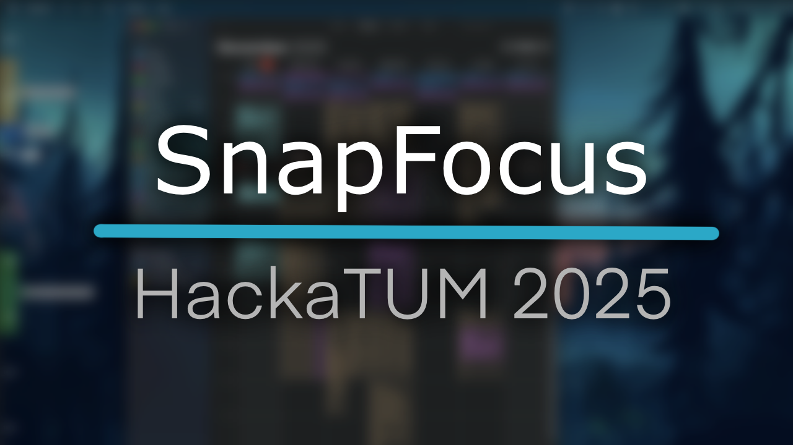

# SnapFocus

A lightweight macOS time-tracking sidebar that syncs with your calendar, visualizes your schedule in real-time, and keeps your current focus in view. A productivity HUD for people who want time to feel tangible.

> **Note:** This project was created as part of the [**HackaTUM 2025**](https://hack.tum.de/) in Munich. Watch the trailer [here](https://youtu.be/t5RNpOGzjjI)!



---

## Features

- **Real-Time Schedule Visualization:** An always-on-top sidebar that displays your calendar events for the day on a vertical timeline.
- **Dynamic "Now" Indicator:** A clear line shows your current position in the day's schedule.
- **Interactive Time Shifting:**
    - **Nudge:** Use keyboard shortcuts (`Up`/`Down` arrows) to extend or shorten the currently active task. Future connected events are automatically shifted.
    - **Bulk Shift:** Move all of today's events at once by a specified time interval (e.g., "+15m", "-1h").
- **Agentic Scheduling with Gemini:** Use natural language to describe your tasks for the day (e.g., "work on my thesis for 3 hours and go for a run"), and let AI generate and save a detailed schedule directly to your calendar.
- **Window Management Integration:** Uses [Rectangle](https://rectangleapp.com/) to offer quick window snapping actions, helping you arrange your workspace for a focused session.
- **Customizable & Persistent Settings:** Configure your Gemini API key securely in the app's preferences.

## Getting Started

### Prerequisites

- macOS
- Xcode
- [Rectangle App](https://rectangleapp.com/) (for window management features)

### Installation

1.  **Clone the repository:**
    ```sh
    git clone https://github.com/your-username/SnapFocus.git
    cd SnapFocus
    ```

2.  **Open the project in Xcode:**
    ```sh
    open SnapFocus.xcodeproj
    ```

3.  **Add Package Dependencies:**
    - In Xcode, go to `File > Add Package Dependencies...`.
    - Paste the following URL into the search bar: `https://github.com/google/generative-ai-swift`
    - Follow the prompts to add the package to the `SnapFocus` target.

4.  **Configure API Key:**
    - Open the app's preferences by pressing `Cmd+,` or going to `SnapFocus > Preferences...`.
    - Enter your Gemini API key and click "Save". You can get a key from [Google AI Studio](https://aistudio.google.com/).

5.  **Build and Run:**
    - Press `Cmd+R` to build and run the application.

## Usage

- **Ruler Overlay:** The main timeline view appears on the left side of your screen. Hover over it to expand and see event details.
- **Nudge Task:** While hovering over the ruler, use the `Up Arrow` and `Down Arrow` keys to adjust the duration of the currently active task.
- **Agentic Scheduler:**
    - Open the scheduler window with `Cmd+Shift+S` or via the `Window > Show Agentic Scheduler` menu.
    - Describe your day's tasks, set a working style (e.g., Pomodoro), and click "Generate Schedule".
- **Bulk Time Shift:** In the scheduler window, enter an offset (e.g., `-30m`) and click "Shift All Today's Events" to move your entire day's schedule.

## License

This project is licensed under the MIT License - see the [LICENSE](LICENSE) file for details.
